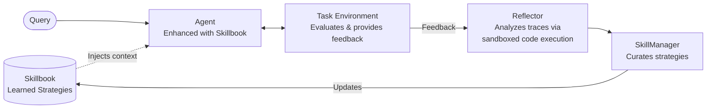

<a href="https://kayba.ai"></a>

# Agentic Context Engine (ACE)


[![Kayba Website](https://img.shields.io/badge/kayba.ai-6B8BA8?style=flat&logo=data:image/png;base64,iVBORw0KGgoAAAANSUhEUgAAACAAAAAgCAYAAABzenr0AAAIpElEQVR42q1XbWwU1xU9d2Z29sPe2V3jyHVwDNixkiBiqKKixA1IBloKCRJSAaU4ip0PhaiJE0JSqSU/WqlpihpXiaJGmJBGSiGOEj4MjsuHhDApENzEjYHaxTbGJUUuBsvaHXt3vbuzM6c/1l6MvW7+5EpPu/t23rvnnvfm3HsFgArAzsvLu1/TtF+SrAYQBKDguzUHgCkipyyRHfFI5AIAVQDA7/evE5E9IhIgp64hAJmxkwggItmRWUOQhENmliHXPpx4nmMiUmuaZrPk5+cvVBSlQ0S8JNMZRkRy7AIRgaqqsG0HyWQCqVQKjuMAABRFhdutw+32QASwbWcagOwXW0Q0kilFUX6giai/FsGkc23agqypqoZ02oJpmvB6vZi/YAHmlZaisLAQiqJgeHgYl/v7MTAwADoODMOAoigTAGVyTwGgkUyLiO44zm/EMIxhEZlDZh+YGvOEcxWmGUEwGMRjjz2GjRs2YunSpfDl+QAAdtrG+Pg4TNPEpUuX0PTxxzh48ADGx8fh9XpBTg9IKAI4pCmGYSQAceekHAJFVRCJRLB27Vq8/tvXseT7SwAAHR0dOHz4MDo6OnD9+nVYloX8vHyUlZdhcWUlUpaF5uZm9Pf3Q1XV20BM3AMASMMwjIRhGMw1CgoKCIAvvPACU8kkSXJgYIBPPPEEjUCAE7zmHHPvnMuqqioWFRXR7/czEAjk8mHlYCBzXpqmIRwOY9OmTfho70eZqP/RgdraWvT29kJEcN999+Ghhx7C3eV3w+P1IBwOo7u7G+3t7RgcHITH44HH44HjOFOjnmqTDExFF2AwGKTP5+OCBQt47T/XmE6n2dXVxbvuuosAWFRUxIaGBl7/73VONytlsedSD7dt20afz8f8/HwGg0HOwrKV8wgmqX/zD2+SJGPRGNesWUMALCkpYVtbW8ZZ0mLn151sOdzC5uZmfvXlV4xFY1kwB/YfoGEY/w/ETACBQID5+fksKvoeey71kCT/2tpKXdfpdru55y97SJKdX3dy3bp1LCwspNvtpsfjYUFBAVetXMVjx44xmcjcmU8++YS6rjMQCOS6BzMBhEIhqqrKVatWMRaN0bEdPv/z5wmA1dXVTCaT7LnUw7KysuyF03WdiqJQRKhpGl0uF3fu3EkrZZEkt2/fTgAsKCiYAUDJpXa2baOsrAxerxfxeBy9vb0AgJUrV0LXdTT8sQEDAwNYvXo1PvjgA5xqO4VDzYewefNmuN1ueDwe1NfX48jRIwCBl7e+jIULFyIej0NRbnc5A8DkTfX7/RBFkEgmYI6aAICysjKMjY7h+PHjCAaD8Pv9OHToEHa9twv33HMP9u7di3f/9C5EFOi6jtdeew1DQ0MovKMQGzdsRCKR+BYAItB1HQBgmqMgCU3VsnNpK40rV67gxtANkMT+/fvR0tKCDz/8EFU/rMKXf/8StXW12PLss4jH4+jq6kJ7ezsIoqqqCrquZ1/JaQAyE4oIysvLoaoqLvf1IRaNId+fj/KycgDAyZMnYaUtpO00HMfBli1b8NRTTyMUCmFkZASNjY2wbRt1dXV46623cPGfF7Fi5Qok4gnMmz8PwWAQ6XQ6NwMiAsuyUFFRgVAohPMXzqPvch9UVcVP1qyBoggOHDyIM2fOYHHlYgQCATQ2NuLP77+PQCCQAd1/GclEEqXzSrF582ZcvHARra2tUDUNXo8XPq8vmz1nAFBVBfF4HEVFRaioqIBpmmhqagIAPPLIWvxo1Y8xNjaKhoYGpFIpjIyMYPuvtuPVX7yKSCQCkiicUwiPx4NIOILly5bh8ccfR9vJNui6C8lkElbauo1+AMgqYSiUEZ8n657kG797I/vanD1zliTZ19vHBx54gACy77yqqnS5XPR6vdQ0jUePHKVlWezu6mZxcTEB8J133iFJfvHFOfr9fhq360FGBwJGZtLn87G0tJSdX3eyoqKCIsJFixbx6r+vkiSvXbvG+vp6FhcXU9O07CiZO5d79+xlOp1mdCzK8fFxfvPNN3zmmWfYfq6dJLl79+4pWjAdwASqSQne1biLx48dnxAZN5csWcLzneezEtvb08sD+/fzvV3vsampiVf6rzCVSDEei7OpqYnLli1jS0sLk8kkw+Ew01aa69evp6IoDIVCMwFkJiaSUF4eS0pKaEZM7vj9DgKg2+1mcXEx3377bd68cZO5LBaNcWRkhPfee282ZwxcGaBt2zz9t9P0+Xy55PgWA4ZxiwUR4aZNm0iSO3bsoMfjoaIoVFWVlfdX8qWXXmLjzkZevXqVfX193Lp1Kx999FFGo1Hu3r2bJXNL2H6unalkhpXq6mpqmjYRvTEbAzOz4SvbXiFJtp1s44MPPkiXy3Vb0XH69GmeOHEi+/u5555jMplkV1cXU4kU6ZAv1r84Wx6YPR0bgQBDoRABsK62jqlkiiS579N9rKmp4eLFi+n3+/n5qc957tw5lpeXs6amhvs+3cdwOELHdhiPxTPORaaf+1QWcgEITMmMGSYqKyv5Wctn2fMeGxtjd3c3BwcHOTw8zBtDN7L/2WmbZ8+e5YoVKwhgFuczSjK4Z2tnNE1DNBqF4zhYvnw5Nvx0Ax5++GHMnz8fLpcLJGFZFgYHB3HhwgUcOnwYra2tSCTGEQgEZkjv9JJMDMMYBmTOlLp9Sh2f+VQUFQAxNjYG27YRDIZw553FKCgogCIKRsdGMXR9CDeHb8JxCMMwoKoKbNuezTEBAemMimEY+0Rkw63GRHI2JoBAVRVABGkrDctKZaNTFBW67oLL5co0gY6TqwCdaraIqCRbJC8vb5Gqqh0i4r7Vmk1nYmbRckvTJdsXfovTyZbLmXBuichSJRaLdYnIz0hGRUTL9IXIycAkLpKgQziOA8exp0Q8y9Jb8zLhPCYiNaZpnlcBqMlk8l8ej+cYyTkA7gCgT6L9DocNIAzgqIg8bZrmCQDq/wBcV6BSGdN3ewAAAABJRU5ErkJggg==&logoColor=white)](https://kayba.ai)
[](https://discord.gg/mqCqH7sTyK)
[](https://twitter.com/kaybaai)
[](https://kayba-ai.github.io/agentic-context-engine/latest/)

> [!TIP]
> ### Try our hosted solution for free at [kayba.ai](https://kayba.ai): automated agent self-improvement from your terminal. CLI + dashboard that analyzes traces, surfaces failures, and ships improvements directly from Claude Code, Codex, and more.
> [](https://kayba.ai)

---

## What is ACE?

ACE enables AI agents to **learn from their execution feedback**—what works, what doesn't—and continuously improve. No fine-tuning, no training data, just automatic in-context learning.

The framework maintains a **Skillbook**: a living document of strategies that evolves with each task. When your agent succeeds, ACE extracts patterns. When it fails, ACE learns what to avoid. All learning happens transparently in context.

- **Self-Improving**: Agents autonomously get smarter with each task
- **20-35% Better Performance**: Proven improvements on complex tasks
- **49% Token Reduction**: Demonstrated in browser automation benchmarks
- **No Context Collapse**: Preserves valuable knowledge over time

---

## Quick Start

### 1. Install

```bash
pip install ace-framework
```

### 2. Set API Key

```bash
export OPENAI_API_KEY="your-api-key"
```

### 3. Run

```python
from ace import ACELiteLLM

agent = ACELiteLLM(model="gpt-4o-mini")

answer = agent.ask("What does Kayba's ACE framework do?")
print(answer)  # "ACE allows AI agents to remember and learn from experience!"
```

**Done! Your agent learns automatically from each interaction.**

[→ Quick Start Guide](https://kayba-ai.github.io/agentic-context-engine/latest/getting-started/quick-start/) | [→ Setup Guide](https://kayba-ai.github.io/agentic-context-engine/latest/getting-started/setup/)

---

## Use Cases

### Claude Code with Learning [→ Quick Start](ace/integrations/claude_code)
Run coding tasks with Claude Code while ACE learns patterns from each execution, building expertise over time for your specific codebase and workflows.

### Automated System Prompting
The Skillbook acts as an evolving system prompt that automatically improves based on execution feedback—no manual prompt engineering required.

### Enhance Existing Agents
Wrap your existing agent (browser-use, LangChain, custom) with ACE learning. Your agent executes tasks normally while ACE analyzes results and builds a skillbook of effective strategies.

### Build Self-Improving Agents
Create new agents with built-in learning for customer support, data extraction, code generation, research, content creation, and task automation.

---

## Demos

### The Seahorse Emoji Challenge

A challenge where LLMs often hallucinate that a seahorse emoji exists (it doesn't).


In this example:
1. The agent incorrectly outputs a horse emoji
2. ACE reflects on the mistake without external feedback
3. On the second attempt, the agent correctly realizes there is no seahorse emoji

[→ Try it yourself](examples/litellm/seahorse_emoji_ace.py)

### Tau2 Benchmark

Evaluated on the airline domain of [τ2-bench](https://github.com/sierra-research/tau2-bench) (Sierra Research) — a benchmark for multi-step agentic tasks requiring tool use and policy adherence. Agent: Claude Haiku 4.5. Strategies learned on the train split with no reward signals; all results on the held-out test split.

*pass^k = probability that all k independent attempts succeed. Higher k is a stricter test of agent consistency.*


ACE doubles agent consistency at pass^4 using only 15 learned strategies — gains compound as the bar gets higher.

### Browser Automation

**Online Shopping Demo**: ACE vs baseline agent shopping for 5 grocery items.


In this example:
- ACE learns to navigate the website over 10 attempts
- Performance stabilizes and step count decreases by 29.8%
- Token costs reduce 49.0% for base agent and 42.6% including ACE overhead

[→ Try it yourself & see all demos](examples/browser-use/README.md)

### Claude Code Loop

In this example, Claude Code is enhanced with ACE and self-reflects after each execution while translating the ACE library from Python to TypeScript.

**Python → TypeScript Translation:**

| Metric | Result |
|--------|--------|
| Duration | ~4 hours |
| Commits | 119 |
| Lines written | ~14k |
| Outcome | Zero build errors, all tests passing |
| API cost | ~$1.5 (Sonnet for learning) |

[→ Claude Code Loop](examples/claude-code-loop/)

---

## Integrations

ACE integrates with popular agent frameworks:

| Integration | ACE Class | Use Case |
|-------------|-----------|----------|
| LiteLLM | `ACELiteLLM` | Simple self-improving agent |
| LangChain | `ACELangChain` | Wrap LangChain chains/agents |
| browser-use | `ACEAgent` | Browser automation |
| Claude Code | `ACEClaudeCode` | Claude Code CLI |
| ace-learn CLI | `ACEClaudeCode` | Learn from Claude Code sessions |
| Opik | `OpikIntegration` | Production monitoring and cost tracking |

[→ Integration Guide](docs/INTEGRATION_GUIDE.md) | [→ Examples](examples/)

---

## How Does ACE Work?

*Inspired by the [ACE research framework](https://arxiv.org/abs/2510.04618) from Stanford & SambaNova.*

ACE enables agents to learn from execution feedback — what works, what doesn't — and continuously improve. No fine-tuning, no training data, just automatic in-context learning. Three specialized roles work together:

1. **Agent** — Your agent, enhanced with strategies from the Skillbook
2. **Reflector** — Analyzes execution traces to extract learnings. In recursive mode, the Reflector writes and runs Python code in a sandboxed REPL to programmatically query traces — finding patterns, errors, and insights that single-pass analysis misses
3. **SkillManager** — Curates the Skillbook: adds new strategies, refines existing ones, and removes outdated patterns based on the Reflector's analysis

The key innovation is the **Recursive Reflector** — instead of summarizing traces in a single pass, it writes and executes Python code in a sandboxed environment to programmatically explore agent execution traces. It can search for patterns, isolate errors, query sub-agents for deeper analysis, and iterate until it finds actionable insights. These insights flow into the **Skillbook** — a living collection of strategies that evolves with every task.



---

## Documentation

> **ACE v2 is coming.** We're rebuilding the framework from the ground up — a cleaner architecture, a modular pipeline engine, first-class async support, and a dramatically simpler API. Follow the progress in [`ace_next/`](ace_next/) and [`pipeline/`](pipeline/), or join the [Discord](https://discord.gg/mqCqH7sTyK) to stay in the loop.

- [Kayba Documentation](https://kayba-ai.github.io/agentic-context-engine/latest/) - Full documentation with guides, API reference, and examples

Quick links:
- [Quick Start Guide](https://kayba-ai.github.io/agentic-context-engine/latest/getting-started/quick-start/) - Get running in 5 minutes
- [Setup Guide](https://kayba-ai.github.io/agentic-context-engine/latest/getting-started/setup/) - Installation, configuration, providers
- [Integration Guide](https://kayba-ai.github.io/agentic-context-engine/latest/integrations/browser-use/) - Add ACE to existing agents
- [API Reference](https://kayba-ai.github.io/agentic-context-engine/latest/api/) - Complete API documentation
- [Examples](examples/) - Ready-to-run code examples
- [Changelog](CHANGELOG.md) - Recent changes

---

## Contributing

Contributions are welcome. Please read our [Contributing Guidelines](CONTRIBUTING.md) before submitting a pull request.

---

## Acknowledgment

Inspired by the [ACE paper](https://arxiv.org/abs/2510.04618) and [Dynamic Cheatsheet](https://arxiv.org/abs/2504.07952).

---

<div align="center">

**⭐ Star this repo if you find it useful!**

**Built with ❤️ by [Kayba](https://kayba.ai) and the open-source community.**

</div>
