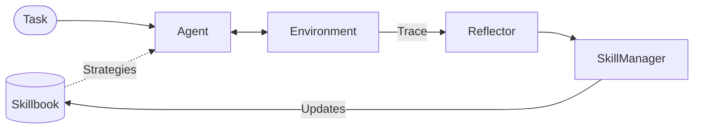

<a href="https://kayba.ai"></a>

# Agentic Context Engine (ACE)


[](https://discord.gg/mqCqH7sTyK)
[](https://twitter.com/kaybaai)
[](https://kayba-ai.github.io/agentic-context-engine/latest/)
[](https://opensource.org/licenses/MIT)
[](https://www.python.org/downloads/)

> [!TIP]
> ### Try our hosted solution at [kayba.ai](https://kayba.ai): automated agent self-improvement from your terminal. CLI + dashboard that analyzes traces, surfaces failures, and ships improvements directly from Claude Code, Codex, and more.
> ### Start your 7-day free trial
> [](https://kayba.ai)

---

**AI agents don't learn from experience.** They repeat the same mistakes every session, forget what worked, and ignore what failed. ACE adds a persistent learning loop that makes them better over time.


> The agent claims a seahorse emoji exists. ACE reflects on the error, and on the next attempt, the agent responds correctly — without human intervention.

---

## Proven Results

| Metric | Result | Context |
|:-------|:-------|:--------|
| **2x consistency** | Doubles pass^4 on Tau2 airline benchmark | 15 learned strategies, no reward signals |
| **49% token reduction** | Browser automation costs cut nearly in half | 10-run learning curve |
| **$1.50 learning cost** | Claude Code translated 14k lines to TypeScript | Zero build errors, all tests passing |

---

## Quick Start

```bash
uv add ace-framework
```

**Option A** — Interactive setup (recommended):

```bash
ace setup            # Walks you through model selection, API keys, and connection validation
```

**Option B** — Manual configuration:

```bash
export OPENAI_API_KEY="your-key"    # or ANTHROPIC_API_KEY, or any of 100+ supported providers
```

Then use it:

```python
from ace import ACELiteLLM

agent = ACELiteLLM(model="gpt-4o-mini")

# First attempt — the agent may hallucinate
answer = agent.ask("Is there a seahorse emoji?")

# Feed a correction — ACE extracts a strategy and updates the Skillbook
agent.learn_from_feedback("There is no seahorse emoji in Unicode.")

# Subsequent calls benefit from the learned strategy
answer = agent.ask("Is there a seahorse emoji?")

# Inspect what the agent has learned
print(agent.get_strategies())
```

No fine-tuning, no training data, no vector database.

[-> Quick Start Guide](https://kayba-ai.github.io/agentic-context-engine/latest/getting-started/quick-start/) | [-> Setup Guide](https://kayba-ai.github.io/agentic-context-engine/latest/getting-started/setup/)

---

## How It Works

ACE maintains a **Skillbook** — a persistent collection of strategies that evolves with every task. Three specialized roles manage the learning loop:

| Role | Responsibility |
|:-----|:---------------|
| **Agent** | Executes tasks, enhanced with Skillbook strategies |
| **Reflector** | Analyzes execution traces to extract what worked and what failed |
| **SkillManager** | Curates the Skillbook — adds, refines, and removes strategies |

The **Recursive Reflector** is the key innovation: instead of summarizing traces in a single pass, it writes and executes Python code in a sandboxed environment to programmatically search for patterns, isolate errors, and iterate until it finds actionable insights.



All roles are backed by [PydanticAI](https://ai.pydantic.dev/) agents with structured output validation. PydanticAI routes to 100+ LLM providers through its LiteLLM integration, with native support for OpenAI, Anthropic, Google, Bedrock, Groq, and more.

*Based on the [ACE paper](https://arxiv.org/abs/2510.04618) (Stanford & SambaNova) and [Dynamic Cheatsheet](https://arxiv.org/abs/2504.07952).*

---

## Runners

| Runner | Class | Description |
|:-------|:------|:------------|
| **LiteLLM** | `ACELiteLLM` | Batteries-included agent with `.ask()`, `.learn()`, `.save()` — accepts any [LiteLLM model string](https://docs.litellm.ai/docs/providers) |
| **Core** | `ACE` | Full learning loop with batch epochs and evaluation |
| **Trace Analyser** | `TraceAnalyser` | Learn from pre-recorded traces without re-running tasks |
| **browser-use** | `BrowserUse` | Browser automation that improves with each run |
| **LangChain** | `LangChain` | Wrap any LangChain chain or agent with learning |
| **Claude Code** | `ClaudeCode` | Claude Code CLI tasks with learning |

```bash
uv add ace-framework[browser-use]    # Browser automation
uv add ace-framework[langchain]      # LangChain
uv add ace-framework[logfire]        # Observability (auto-instruments PydanticAI)
uv add ace-framework[mcp]            # MCP server for IDE integration
uv add ace-framework[deduplication]  # Embedding-based skill deduplication
```

Have existing agent logs? Extract strategies from them directly:

```python
from ace import ACELiteLLM

agent = ACELiteLLM(model="gpt-4o-mini")
agent.learn_from_traces(your_existing_traces)
print(agent.get_strategies())
```

[-> Examples](examples/)

---

## Benchmarks

### Tau2 — Multi-Step Agentic Tasks

[tau2-bench](https://github.com/sierra-research/tau2-bench) by Sierra Research: airline domain tasks requiring tool use and policy adherence. Claude Haiku 4.5 agent, strategies learned on the train split with no reward signals, evaluated on the held-out test split.


*pass^k = probability all k independent attempts succeed. ACE doubles consistency at pass^4 with 15 learned strategies.*

### Claude Code — Autonomous Translation

ACE + Claude Code translated this library from Python to TypeScript with zero supervision:

| Metric | Result |
|:-------|:-------|
| Duration | ~4 hours |
| Commits | 119 |
| Lines written | ~14,000 |
| Build errors | 0 |
| Tests | All passing |
| Learning cost | ~$1.50 |

---

## Pipeline Architecture

ACE is built on a composable pipeline engine. Each step declares what it requires and what it produces:

```
AgentStep -> EvaluateStep -> ReflectStep -> TagStep -> UpdateStep -> ApplyStep -> DeduplicateStep
```

Use `learning_tail()` for the standard learning sequence, or compose custom pipelines:

```python
from ace import Pipeline, AgentStep, EvaluateStep, learning_tail

steps = [AgentStep(agent), EvaluateStep(env)] + learning_tail(reflector, skill_manager, skillbook)
pipeline = Pipeline(steps)
```

The pipeline engine ([`pipeline/`](pipeline/)) is framework-agnostic with `requires`/`provides` contracts, immutable context, and error isolation. See [Pipeline Design](docs/PIPELINE_DESIGN.md) and [Architecture](docs/ACE_DESIGN.md).

---

## CLI

| Command | Description |
|:--------|:------------|
| `ace setup` | Interactive setup — model selection, API keys, connection validation |
| `ace models <query>` | Search available models with pricing |
| `ace validate <model>` | Test a model connection |
| `ace config` | Show current configuration |
| `kayba` | Cloud CLI — upload traces, fetch insights, manage prompts |
| `ace-mcp` | MCP server for IDE integration |

---

## Documentation

- [Full Documentation](https://kayba-ai.github.io/agentic-context-engine/latest/) — Guides, API reference, examples
- [Quick Start](https://kayba-ai.github.io/agentic-context-engine/latest/getting-started/quick-start/) — 5-minute setup
- [Setup Guide](https://kayba-ai.github.io/agentic-context-engine/latest/getting-started/setup/) — Configuration and providers
- [Architecture](docs/ACE_DESIGN.md) — Design decisions and core types
- [Pipeline Engine](docs/PIPELINE_DESIGN.md) — Step composition and context flow
- [PydanticAI Migration](docs/PYDANTIC_AI_MIGRATION.md) — What changed and why
- [Examples](examples/) — Runnable demos
- [Changelog](CHANGELOG.md) — Version history

---

## Contributing

Contributions are welcome. See [Contributing Guidelines](CONTRIBUTING.md).

---

<div align="center">

**Built by [Kayba](https://kayba.ai) and the open-source community.**

</div>
